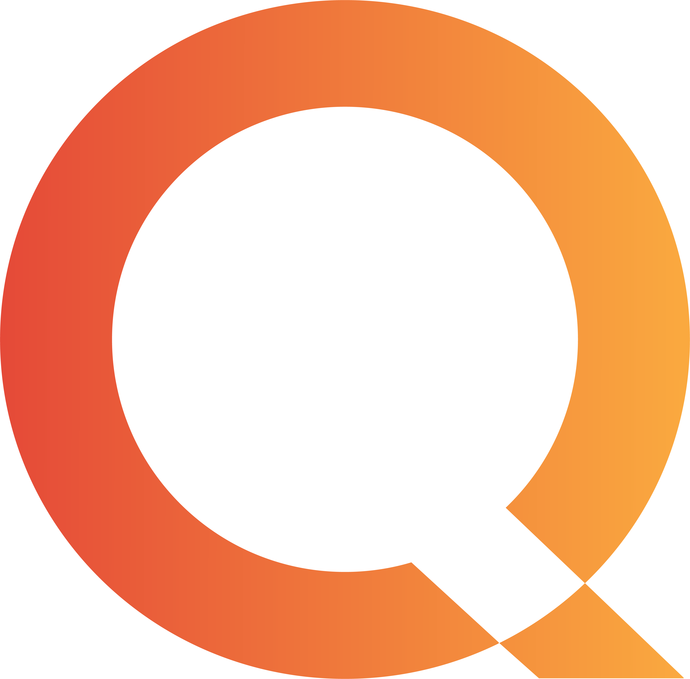
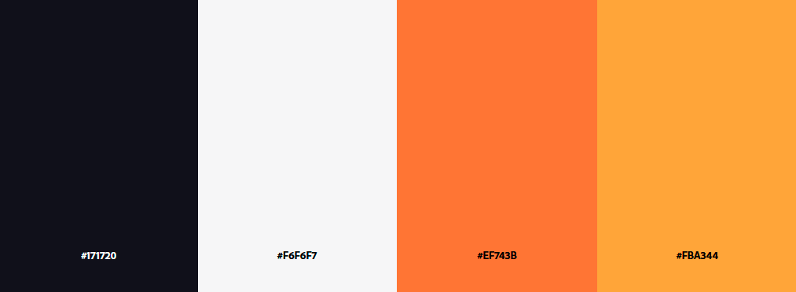

 

  

  
Este é o Site criado para o Projeto de html da faculdade, feito pelo nosso time, Quick tech, uma empresa inovadora, que trabalhará com manutenções e consultoria para Desktop e Notebooks, onde iremos atender tanto pessoas físicas como pessoas jurídicas, teremos nossa loja física, e também atenderemos a domicílio, seremos uma EPP (Empresa de pequeno porte) com foco na qualidade do atendimento para nossos clientes.

## Em Desenvolvimento
O projeto Quick Tech ainda está em fase de desenvolvimento ativo. Estamos trabalhando arduamente para aprimorar e adicionar novos recursos.

## Tecnologias Utilizadas
O projeto Quick Tech foi desenvolvido utilizando as seguintes tecnologias:

- **html:** Linguagem de marcação para estruturar o conteúdo da web.
- **CSS:** Linguagem de estilo para estilizar a apresentação do conteúdo.
- **JavaScript:** Linguagem de programação para interatividade e dinamismo.
- **Bootstrap:** Framework de design para facilitar o desenvolvimento de interfaces responsivas.

## Nossa paleta de cores

---

### Desenvolvedores: 
|Nome|Email| GitHub | 
| -------- | -------- | -------- | 
|Vitor Machado|vitorgomes.machado94@gmail.com|https://github.com/VITOR-DV|
|Fernando Namba|namba.fernando@gmail.com|https://github.com/FernandoNamba|
|Lucas Eduardo|lelds.2001@gmail.com|https://github.com/lucaseduardo09|
|Vinícius Stein|Viniisteinn@gmail.com|https://github.com/vnzinn01|
|Santiago Castrillon|santiagocastrillonprof@gmail.com|https://github.com/san2003|
